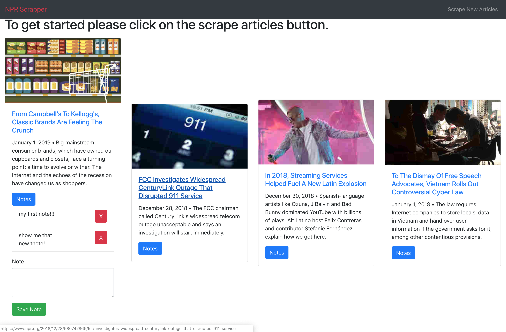

# Scraping_for_news
The idea for this site is for the user to be able to scrape news articles from the npr website ( <https://www.npr.org/sections/technology/> ).

1. The user will be able to follow the link to the article by clicking the title of the article.
2. The will be able to see/add notes per article by clicking the notes button.
    * It will let you save new notes by clicking the save new note button.
    * It will also let you delete individual notes by pressing the red X button next to each note.
    * It will show new notes above the save note form.

